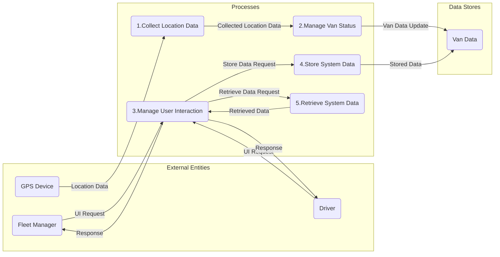

```mermaid
graph LR
    subgraph External Entities
        FM(Fleet Manager)
        D(Driver)
        GPS(GPS Device)
    end

    subgraph Processes
        P1(1.Collect Location Data)
        P2(2.Manage Van Status)
        P3(3.Manage User Interaction)
        P4(4.Store System Data)
        P5(5.Retrieve System Data)
    end

    subgraph Data Stores
       VD(Van Data)
    end
    
    GPS -->|Location Data| P1
    P1 -->|Collected Location Data| P2
    P2 -->|Van Data Update| VD
    FM -->|UI Request| P3
    D -->|UI Request| P3
    P3 -->|Store Data Request| P4
    P4 -->|Stored Data| VD


    P3 -->|Retrieve Data Request| P5
    P5 -->|Retrieved Data| P3
    P3 -->|Response| FM
    P3 -->|Response| D
```
