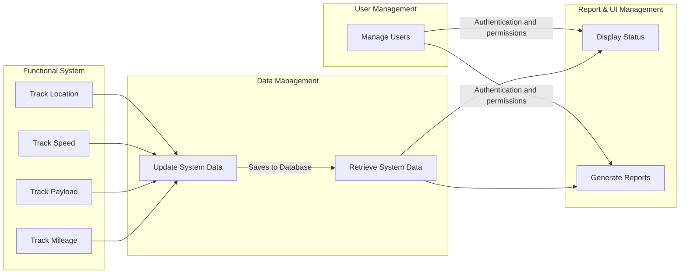

```mermaid
graph LR
    subgraph Functional System
    TL[Track Location]
    TS[Track Speed]
    TP[Track Payload]
    TM[Track Mileage]
        end
    
    subgraph Data Management
        USD[Update System Data]
        RSD[Retrieve System Data]
    end

    subgraph User Management
    MU[Manage Users]
    end
    
    subgraph Report & UI Management
       DS[Display Status]
       GR[Generate Reports]
    end

    TL --> USD
    TS --> USD
    TP --> USD
    TM --> USD
    MU -->|Authentication and permissions| DS
    MU -->|Authentication and permissions| GR
    RSD --> DS
    RSD --> GR
   USD -->|Saves to Database| RSD
```
