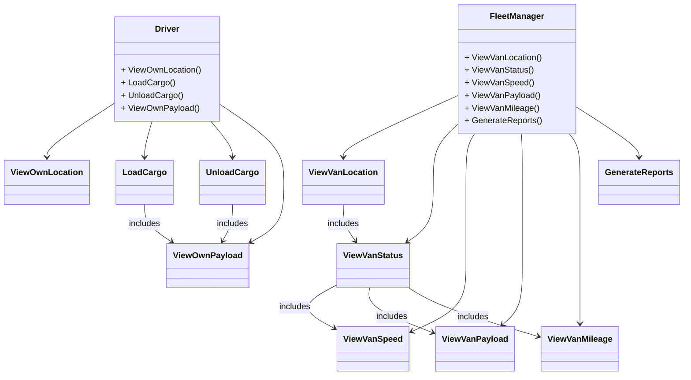

```mermaid
classDiagram

class FleetManager {
    + ViewVanLocation()
    + ViewVanStatus()
    + ViewVanSpeed()
    + ViewVanPayload()
    + ViewVanMileage()
    + GenerateReports()
}

class Driver {
    + ViewOwnLocation()
    + LoadCargo()
    + UnloadCargo()
    + ViewOwnPayload()
}

class ViewVanLocation
class ViewVanStatus
class ViewVanSpeed
class ViewVanPayload
class ViewVanMileage
class LoadCargo
class UnloadCargo
class ViewOwnPayload

FleetManager --> ViewVanLocation
FleetManager --> ViewVanStatus
FleetManager --> ViewVanSpeed
FleetManager --> ViewVanPayload
FleetManager --> ViewVanMileage
FleetManager --> GenerateReports

Driver --> ViewOwnLocation
Driver --> LoadCargo
Driver --> UnloadCargo
Driver --> ViewOwnPayload

ViewVanLocation --> ViewVanStatus : includes
ViewVanStatus --> ViewVanSpeed : includes
ViewVanStatus --> ViewVanPayload : includes
ViewVanStatus --> ViewVanMileage : includes
LoadCargo --> ViewOwnPayload : includes
UnloadCargo --> ViewOwnPayload : includes
```
