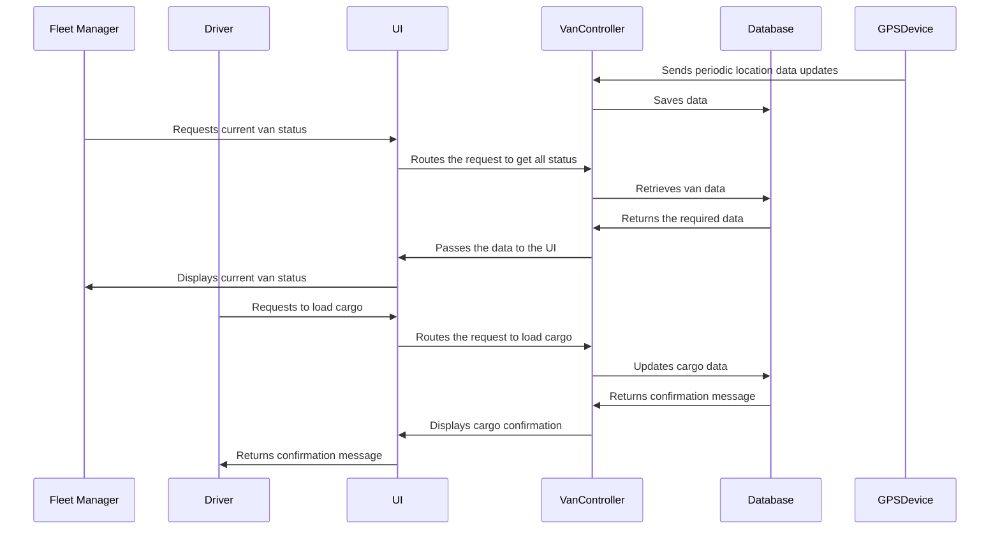

```mermaid
sequenceDiagram
    participant Fleet Manager
    participant Driver
    participant UI
    participant VanController
    participant Database
    participant GPSDevice

    GPSDevice->>VanController: Sends periodic location data updates
    VanController->>Database: Saves data
    
    Fleet Manager->>UI: Requests current van status
    UI->>VanController: Routes the request to get all status
    VanController->>Database: Retrieves van data
    Database->>VanController: Returns the required data
    VanController->>UI: Passes the data to the UI
    UI->>Fleet Manager: Displays current van status

    Driver->>UI: Requests to load cargo
    UI->>VanController: Routes the request to load cargo
    VanController->>Database: Updates cargo data
    Database->>VanController: Returns confirmation message
    VanController->>UI: Displays cargo confirmation
    UI->>Driver: Returns confirmation message
```
